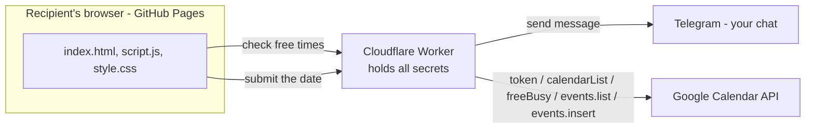

# Date Night 💕

A playful, single-page "Will you go on a date with me?" invitation. The recipient picks
an activity (and food, if it's dinner), a date/time, and an excitement level. When they
send it, **you** get a Telegram message with everything, and the date is **auto-added to
your Google Calendar** — but only if you're actually free: the app checks *all* your
calendars and greys out the times you're busy.

- **Live site:** `https://<YOUR_USERNAME>.github.io/<YOUR_REPO>/`
- **Stack:** plain HTML + CSS + JS (no framework, no build step) + one Cloudflare Worker

---

## Features

- **Playful invite** — a "NO" button that dodges the cursor (with cute teasing lines after
  repeated tries), and a YES that advances.
- **15 date ideas** + two "who plans it" modes; editable details with preset "vibes."
- **Two-step food** (cuisine → dish) when Dinner is picked.
- **Smart scheduling** — greys out times you're busy across *every* calendar you have,
  blocks conflicts at submit, 12-hour AM/PM times, no past dates/times.
- **Telegram notification** — the full answer + device info + approximate location + a
  one-tap "add to my calendar" link.
- **Auto-add to your Google Calendar** when you're free (with a 2-hour pre-event buffer).
- **Personalized links** — `?to=Name` greets them by name.
- **Romantic extras** — a note from her, a live countdown, and weather for the day.
- **Polished** — portfolio-matched fonts, responsive, snappy hover, error/retry on send.

---

## How it works (architecture)



Three pieces, clear jobs:

- **GitHub Pages** – hosts the static page the recipient opens.
- **Cloudflare Worker** – holds **every** secret (Telegram + Google) and does the work:
  forwards the answer to Telegram, checks your calendar availability, and creates the
  event. Secrets never touch the public page.
- **Google Calendar API** – the Worker reads your calendars (free/busy) and writes the
  event, using an OAuth refresh token stored in the Worker.

Her own **"Add to Google Calendar"** button on the final screen is just a
`calendar.google.com/render?...` link built in the browser — *that* part needs no setup.
The **auto-add to your calendar** and the **free-time check** need the one-time Google
setup below.

---

## Project structure

| File | What it is |
|------|------------|
| `index.html` | Page markup + all the screen templates (`<template>` blocks) |
| `script.js`  | All front-end logic: screen flow, dodging "NO" button + teases, availability greying, timezone helpers, Telegram/calendar payloads, activity/food/emoji data |
| `style.css`  | Styling + the pink color palette (CSS variables) |
| `worker.js`  | The Cloudflare Worker: Telegram + calendar availability + event creation — **not served by the site**; you paste it into Cloudflare (see below) |

---

## Setup — reproduce from scratch

### 1. Create a Telegram bot

1. In Telegram, search **`@BotFather`**, press **Start**, send `/newbot`.
2. Give it a name, then a username ending in `bot` (e.g. `my_date_bot`).
3. BotFather replies with an **HTTP API token** like `123456789:AA...`. Keep it private.
4. Open your new bot and press **Start** (so it's allowed to message you).
5. Get **your personal chat ID**: message **`@userinfobot`** — it replies with your
   numeric ID (e.g. `96914393`).
   ⚠️ This is **your** ID, *not* the bot's ID (the bot's ID is the number before the
   `:` in the token — don't use that).
6. (Optional) Test the token + chat ID in a browser:
   `https://api.telegram.org/bot<YOUR_BOT_TOKEN>/sendMessage?chat_id=<YOUR_CHAT_ID>&text=hi`
   If you get "hi" in Telegram, it works.

### 2. Create the Cloudflare Worker (keeps your token secret)

1. Go to [dash.cloudflare.com](https://dash.cloudflare.com) → **Workers & Pages** →
   **Create** → **Create Worker** → **Start with Hello World!** → name it → **Deploy**.
2. Click **Edit code**, delete the sample, paste the entire contents of
   [`worker.js`](worker.js), then **Deploy**.
3. In the Worker's **Settings → Variables and Secrets**, add two variables and mark
   each as **Secret / Encrypt**:
   | Name | Value |
   |------|-------|
   | `BOT_TOKEN` | your bot token from step 1 |
   | `CHAT_ID`   | your personal chat ID from step 1 |
   Then **Deploy** again so the variables take effect.
4. Copy the Worker's URL, e.g. `https://<name>.<subdomain>.workers.dev`.

> The token and chat ID live **only** inside Cloudflare — never in this repo or the
> public page.

### 3. Point the site at your Worker

In [`script.js`](script.js), set the `WORKER_URL` constant (near the top of the file — it's
used by both the availability check and the submit) to your Worker URL:

```js
const WORKER_URL = "https://<name>.<subdomain>.workers.dev/";
```

Test locally (see *Running locally*), complete the flow, and confirm you receive the
Telegram message.

### 4. Host it on GitHub Pages

1. Create an empty repo on GitHub and push this folder to it (see *Deploying updates*).
2. Repo **Settings → Pages → Source: Deploy from a branch → `main` / `root` → Save**.
3. ~1 minute later it's live at `https://<YOUR_USERNAME>.github.io/<YOUR_REPO>/`.
   Send **that** link.

> You can have this **and** a personal portfolio site on one account — every account
> gets one `username.github.io` site plus unlimited `username.github.io/<repo>`
> project sites (this is a project site).

### Her "Add to Google Calendar" button — no setup

The final screen's **📅 Add to Google Calendar** button is a plain
`calendar.google.com/render` link built in the browser (`googleCalUrl` in `script.js`),
pre-filled with the plan, food, notes, date/time (2-hour event), and `Kingston, Ontario`.
It works with zero configuration. *(Auto-adding to **your own** calendar and the
availability check are the optional Google setup — see below.)*

---

## Running locally

From this folder:

```bash
python -m http.server 8123
```

Then open <http://localhost:8123/>. (Any static file server works.)
Note: the Telegram send only works once `WORKER_URL` points at a deployed Worker.

---

## Deploying updates

GitHub Pages redeploys automatically on every push to `main`:

```bash
git add index.html script.js style.css worker.js README.md
git commit -m "your message"
git push
```

**Cache-busting:** `index.html` loads `style.css?v=N` and `script.js?v=N`. When you change
CSS/JS, **bump `N`** so browsers fetch the new file instead of a cached one. (First-time
visitors always get the latest — this only matters while you're iterating.) Then
hard-refresh (Ctrl/Cmd + Shift + R).

> ⚠️ The **Worker is deployed separately** — pushing to GitHub does **not** update it.
> After editing `worker.js`, paste it into the Cloudflare editor and **Deploy**.

---

## Customizing

### Activities
Edit the tiles in `index.html` under `#activity-grid`. Each tile:

```html
<button class="grid-btn" data-ekey="coffee" data-value="Coffee + Walk ☕">
  <span class="tile-emoji">☕🥐</span><span class="tile-label">Coffee</span>
</button>
```

- `data-ekey` links to the emoji-rain theme and preset list (below).
- `data-value` is the full text pre-filled on the "tweak the details" step.
- `data-ekey="dinner"` is special — it routes to the food picker.
- Two `.special-btn` tiles are the "who plans it" options.

Then in `script.js`:
- `ACTIVITY_EMOJIS` – the falling-emoji set for each `data-ekey`.
- `ACTIVITY_PRESETS` – the "vibe" suggestions shown on the details step for each `data-ekey`.

Keep the grid a multiple of 3 tiles so it stays symmetrical (3 columns).

### Food (cuisines & dishes)
Edit the `CUISINES` array in `script.js`. Each entry has a `name`, an `emoji`, and a
`dishes` list of `{ e: emoji, n: name }`.

### Colors (pink palette)
All colors come from CSS variables at the top of `style.css`:
`--pink-50` (lightest, page background) → `--pink-900` (darkest). Change these to
re-theme the whole site.

### Emojis look different per device — that's normal
The page uses each device's **native** emoji font: an iPhone/Mac shows Apple-style
emojis, Windows shows Microsoft's, Android shows Google's. This is intentional — the
recipient sees their own OS's emojis. (There's no legal way to force Apple emojis on
other devices, and adding an emoji-image library would *override* the nice Apple ones
on an iPhone.)

---

## Personalized links & location

- **Tag who you send it to** — append `?to=<name>` to the link, e.g.
  `https://<user>.github.io/<repo>/?to=<name>`. The page then greets them by name
  ("`<name>`, will you go on a date with me?"), sets the tab title, and includes
  **`👤 Invited: <name>`** in your Telegram message. Without `?to=`, everything works
  as a generic invite. (Parsed in `parseRecipient()` in `script.js`.)
- **Approximate location** — the Cloudflare Worker adds the visitor's approximate
  **city / region / country**, postal code, a Google Maps pin, and IP to the Telegram
  message, using Cloudflare's built-in `request.cf` geo. This is **city-level, not a
  precise neighborhood**, and requires re-deploying `worker.js` in Cloudflare after
  changes.

## Auto-add to your Google Calendar (optional)

When enabled, the Worker creates the date on **your** Google Calendar automatically the
moment she submits (in addition to Telegram) — no taps from anyone. It's optional: if the
Google secrets below aren't set, the Worker just skips this step.

**Availability check:** before creating the event, the Worker checks your **entire**
calendar set (General, group, and imported/Outlook calendars) for that window, via both
free/busy and `events.list` (the latter catches subscribed calendars + zero-duration
"deadline" events). If you're busy it returns `{ conflict: true }` — no event, no Telegram
— and the page asks her to pick another time. Fails *open* on error so a hiccup never
wrongly blocks a real date.

**Free-time greying (proactive):** when she picks a date, the page calls the Worker's
`?availability=1&dayStart=…&dayEnd=…` endpoint (returns `{ busy: [{start,end}] }`) and
**greys out the time slots you're not free**, so she rarely hits a conflict at all.

**Busy buffer:** each event marks you busy from **2 hours before its start** through its
**end** (you're free the moment it ends). Tune `BUFFER_MS` in `collectBusy` in `worker.js`.

**Extras:** the final screen shows a live **countdown** to the date and a **weather
forecast** for the day (free Open-Meteo API, when within its ~16-day range). On the
excitement step she can leave a short **note** that comes through in your Telegram and the
calendar event's description.

Set these extra secrets on the Worker (Settings → Variables and Secrets), then paste the
latest [`worker.js`](worker.js) and Deploy:

| Secret | From |
|--------|------|
| `GOOGLE_CLIENT_ID` | Google Cloud Console → OAuth client |
| `GOOGLE_CLIENT_SECRET` | Google Cloud Console → OAuth client |
| `GOOGLE_REFRESH_TOKEN` | OAuth Playground (one-time authorization) |
| `EVENT_TIMEZONE` | optional, defaults to `America/Toronto` |

One-time setup:
1. **console.cloud.google.com** → create a project → **APIs & Services → Library** →
   enable **Google Calendar API**.
2. **OAuth consent screen** → External → add your email + the
   `.../auth/calendar` scope → add yourself as a **Test user** → **Publish app**
   (production, so the refresh token doesn't expire after 7 days).
   *(The full `calendar` scope is required — it covers creating events, the free/busy
   availability check, and listing all your calendars. The narrower `calendar.events`
   scope cannot run free/busy.)*
3. **Credentials → Create OAuth client ID → Web application** → add redirect URI
   `https://developers.google.com/oauthplayground` → copy the Client ID + Secret.
4. **developers.google.com/oauthplayground** → gear icon → *Use your own OAuth
   credentials* → paste ID + Secret. In Step 1 enter scope
   `https://www.googleapis.com/auth/calendar` → Authorize → sign in → Step 2
   *Exchange authorization code for tokens* → copy the **refresh token**.
5. Put the three values into the Worker secrets, paste `worker.js`, Deploy.

The event lands on your `primary` calendar, titled from `evTitle` (e.g. `Date with <name> ❤️`,
or just `Date ❤️` for a generic link).

### Worker API (what it does under the hood)

The Worker (`worker.js`) answers two request shapes from the page and, when Google is
configured, talks to the Calendar API with the OAuth refresh token.

**Request modes (page → Worker):**

| Mode | Query params | Returns |
|------|--------------|---------|
| **Availability** | `?availability=1&dayStart=<rfc3339>&dayEnd=<rfc3339>` | `{ busy: [{start,end}] }` (epoch ms) — used to grey out busy time slots |
| **Submission** | `?text=…&evTitle=…&evStart=…&evEnd=…&evDesc=…&evLoc=…` | `{ conflict, telegramOk, calendarOk }` |

**Google Calendar API calls (Worker → Google) — it reads your *whole* calendar set, not just events:**

| Endpoint | Purpose |
|----------|---------|
| `POST oauth2.googleapis.com/token` | Exchange the refresh token for a short-lived access token |
| `GET  calendar/v3/users/me/calendarList` | Enumerate **all** your calendars (owned, shared, imported/Outlook) |
| `POST calendar/v3/freeBusy` | Busy blocks across those calendars (works for standard Google calendars) |
| `GET  calendar/v3/calendars/{id}/events` | Per-calendar events — catches **imported/Outlook** calendars and zero-duration "deadline" events that free/busy misses |
| `POST calendar/v3/calendars/primary/events` | Create the date on your primary calendar |

Both the availability endpoint and the submission conflict check share one `collectBusy()`
routine, so they always agree.

**Busy logic:** an event counts as busy unless it's cancelled, marked **Free**
(transparent), all-day (holidays/birthdays), or you **declined** it. Each busy block is
then padded to begin **2 hours before** the event's start and end at the event's end
(`BUFFER_MS` in `worker.js`). A proposed 2-hour date that overlaps any busy block is a
conflict.

## Notes

- **Secrets** (bot token, chat ID) live only in Cloudflare — never commit them.
- The Telegram message includes some device info (browser, OS, screen, timezone, etc.)
  gathered in `SystemDetector`; trim that in `script.js` if you'd rather not send it.
- Date picker blocks past dates; if "today" is chosen, only future times are selectable.
